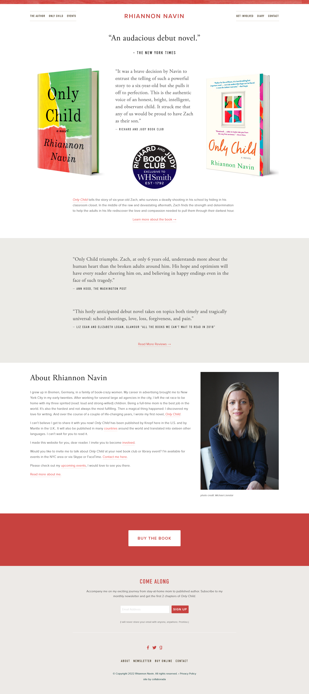
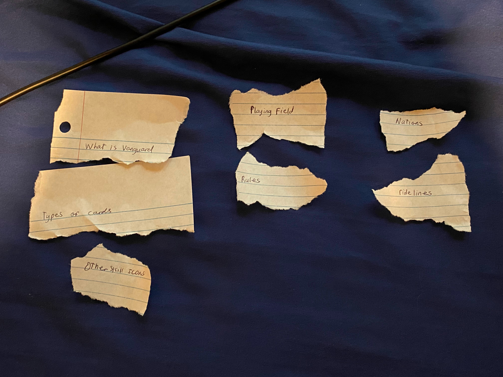
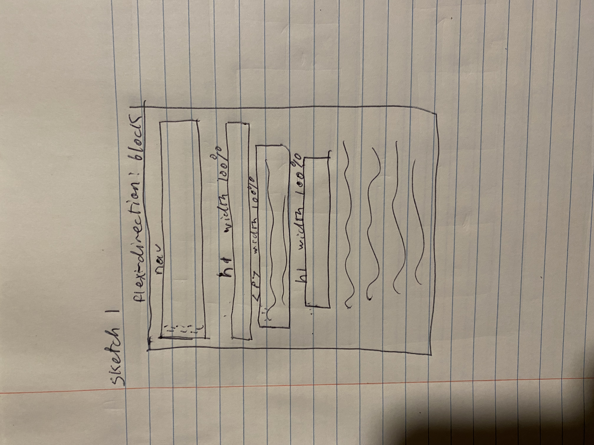
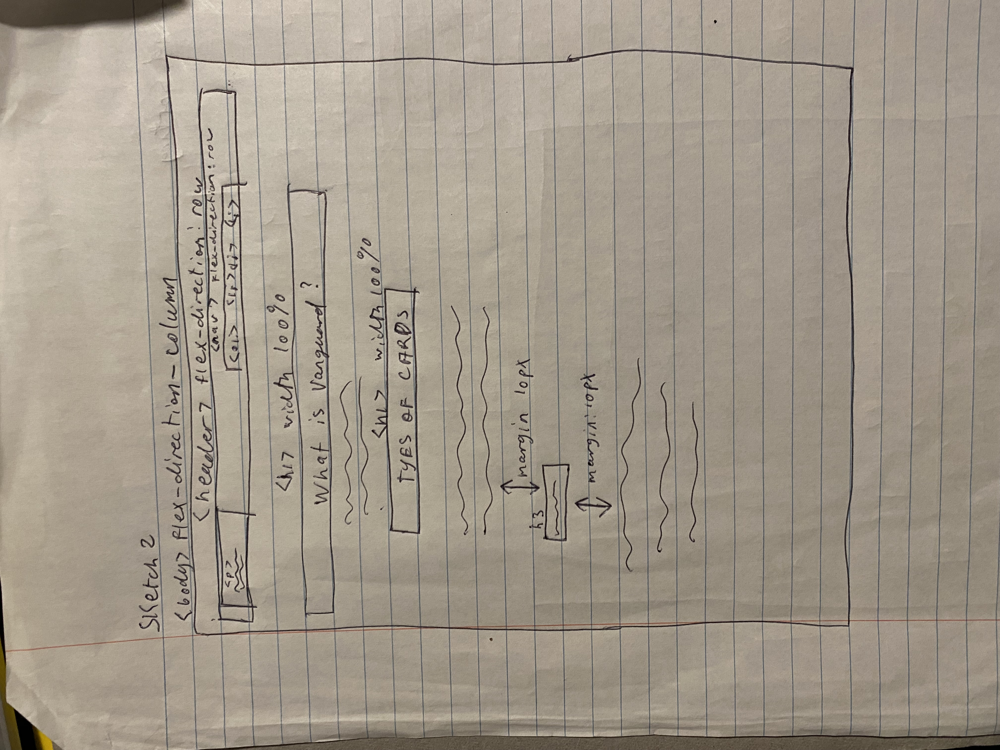
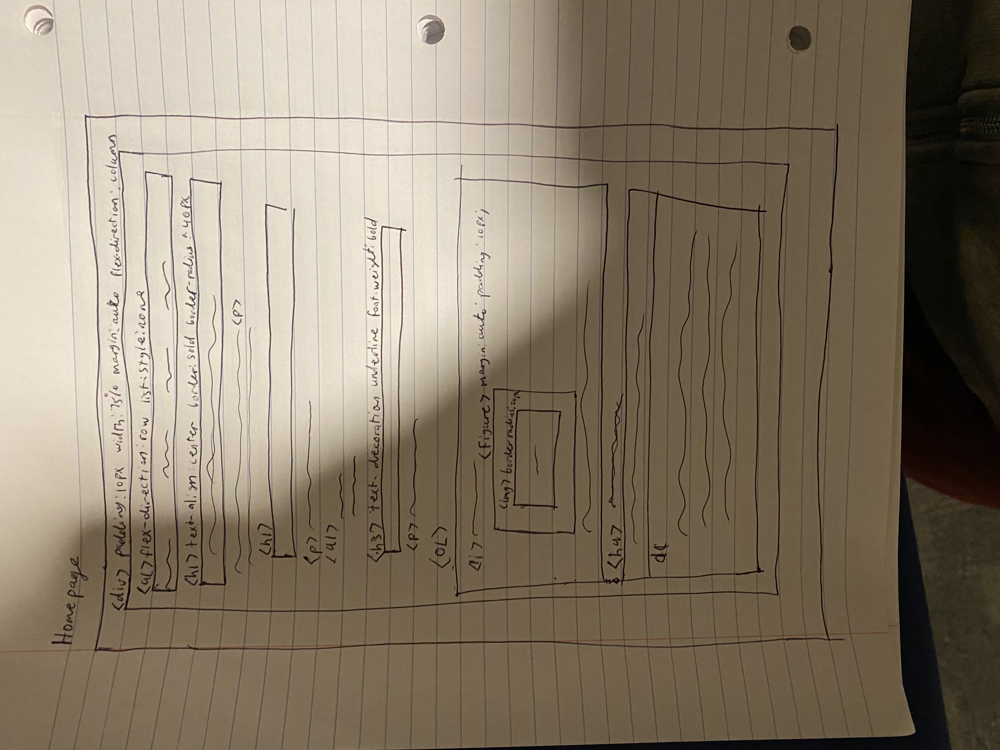
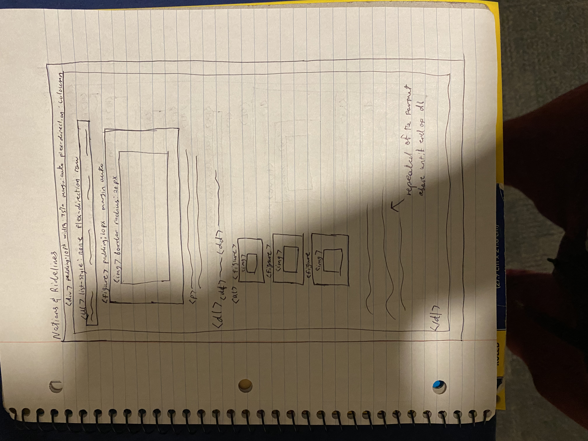
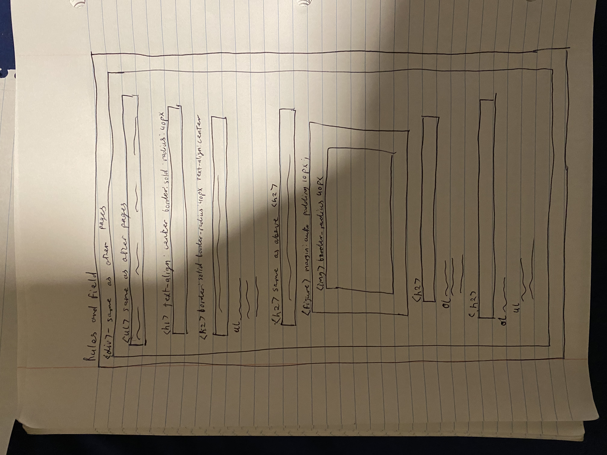
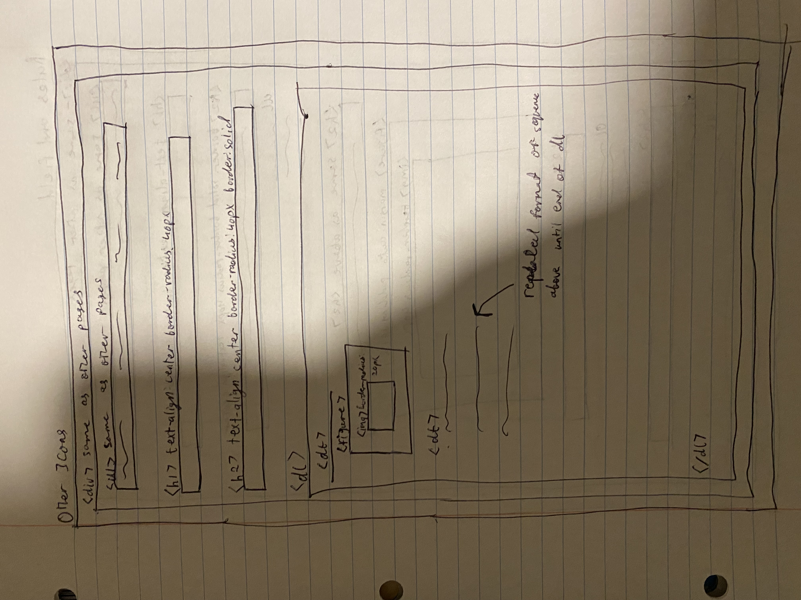

# Project 1: Design Journey

## Personal Site (Milestone 1)

### Website Topic (Milestone 1)
> Briefly explain what your website will be about. Share your vision of your personal website.
>
> The purpose of my website would be to introduce new players to the D-Formart in the card game Vanguard. It would include the rules, explain rarities and what the 5 nations that could be used

### Device (Milestone 1)
> How you will your audience likely access your website? On a laptop/desktop computer or a mobile device?
> You will design your website for mobile or desktop devices (not both).

 The will access the website from a desktop device

## Personal Website Design Exploration (Milestone 1)

Identify three personal websites (preferably static websites) that exist today on the web. You will be drawing inspiration from these sites for your own site; please select websites that are similar to the website you wish to create.

Include a screenshot of the home page for each site. If you're planning a mobile website, your screenshots should be from a mobile website. If you're planning a desktop website, your screenshots should be from a desktop website.

**We'll refer to these are your "example websites."**

> 1. <https://basicswithbabish.co/>
>     
> 2. <https://www.garysheng.com/>
>     
>
> 3. <https://www.rhiannonnavin.com/>
>     

### Personal Website 1 Review (Milestone 1)
> Review the personal website you identified above. (1-2 paragraphs)
>
> - Who do you think this site is designed for? Who is its intended audience?
> - What **goals** do you think the audience likely has when visiting this site.
> - What **content** is included?
> - Do you believe the content likely **addresses** the goals of the site's audience?
> - What do you like about the design?
> - Is the site designed for desktop, mobile, or desktop and mobile devices?

From looking through the webiste, this website is intended for viewers to be able to learn how to cook using different styles and techniques. Most persons would come to this website in order to learn how to cook different kinds of dishes,front face and center the first thing you see upon visiting the website is a gif showcasing some of the techniques he uses, this peaks the curiosity of the user to go further down and it is there where he presents the content of the website.

Each of the dishes he makes has an image attached to them so you may be able to see the dish in completion,along with the recipe.Another plus is that each image acts as a hyperlink to his Youtube channel where you could see him prepare the dish as well, making it easier for the audience to better satisfy their goal. The thing I like the most about the website is how everything pops out at you in a moderate level,you don't simply just look at walls of text, there is always something that helps to pull your attention to that area. One thing that I didn't like was how the search bar was blended into the background. This websites also works well on both desktop devices and mobile devices.

### Personal Website 2 Review (Milestone 1)
> Review the personal website you identified above. (1-2 paragraphs)
>
> - Who do you think this site is designed for? Who is its intended audience?
> - What **goals** do you think the audience likely has when visiting this site.
> - What **content** is included?
> - Do you believe the content likely **addresses** the goals of the site's audience?
> - What do you like about the design?
> - Is the site designed for desktop, mobile, or desktop and mobile devices?

The purpose of the site was to show his resume to users,as a person's goal for visiting said website is to see if he would be a good person to hire. The website is very simple and streamlined as quick glances to things he has done and also has been apart of, which makes it easier for persons to determine if he would be a good fit for their company. The big thing that I like about this website is just how simple it is, but it was still able to get very important information about himself across without it being too confusing. This website was designed for both mobile and deskstop devices

### Personal Website 3 Review (Milestone 1)
> Review the personal website you identified above. (1-2 paragraphs)
>
> - Who do you think this site is designed for? Who is its intended audience?
> - What **goals** do you think the audience likely has when visiting this site.
> - What **content** is included?
> - Do you believe the content likely **addresses** the goals of the site's audience?
> - What do you like about the design?
> - Is the site designed for desktop, mobile, or desktop and mobile devices?

The purpose of this site is to learn more about the author and her book. Someone visiting this website would want to know more about her, what is her book about as well as if it is well recieved. The content she gives I would say was good enough to statisfy the user's goals as she has pictures of book in question along with extracts from it and reviews on the book, though I feel like there should have been an area for the users to make their own reviews as some times there is a disconnect bewtween a regular reader and someone from places like New York times. I like the fact that everything has its own section so you would never feel lost on the page. One of best things on this site for me would the fact it gives you the chance to buy the book on the website as well as showing you the different foreign versions of the book so you know exactly if it would be available in your country. From the looks of it,this website works on both mobile and desktop devices.

## Audience & Goals (Milestone 1)

Using what you learned from studying the example websites, identify your website's audience and their goals.

### Audience (Milestone 1)
> Briefly explain who the intended audience is for your website. Be specific and justify why this audience is appropriate for your site's topic.

The audience of my website are persons who never played Vanguard before and are curious about it, I see them as an appropriate audience for my website, as my website goes over the types of cards, how to read them along with the gameboard and how a players turn would go about. These are all things someone who has played Vanguard before would know about but not new players

### Audience Goals (Milestone 1)
> Why would your audience visit your site?
> Identify at least 3 goals that your users have for visiting your website.

1. The rules of the game

2. What exactly are the 5 nations they may use

3. How read the different cards in the game

## Content Planning (Milestone 1)

Plan your site's content.

### Your Site's Planned Content (Milestone 1)
> List **all** the content you plan to include your personal website.
> You should list all types of content you planned to include (i.e. text, photos, images, etc.)

- Images
- Text

### Content Justification (Milestone 1)
> Explain (about a paragraph) why this content is the right content for your site's audience and how the content addresses their goals.

This type of content would be perfect for my audience as this is a card game so they would need both these types of content. The text is there to give verbal explanations for the different rules of the game as well as for words and jargon that exists solely in the game. The purpose of the images is so that they may go along with the text so that the audience can physically see what was being said in the text so that they may have a better grasp of the game.

### Home Page Content (Milestone 1)
> What is the content that your users would expect when visiting your site for the first time.
>
> Briefly identify what content you will include on the homepage and why this content should be the first thing your target audience sees when they visit your site.

My homepage would include what exactly Vanguard is and would then detail what the different types of cards are and how to read them. This should be the first things they see as it would give a brief overview as to what the game is and from my experience its best show the different types of cards that are in the game to a person before diving right into the rules of it.

## Information Architecture (Milestone 2)

For milestone 2, you will design the information architecture for all the pages your website.

You may change your homepage content based on your card sorting. If you do change the homepage content, don't update it above, just include the new plan in the section below (Content Organization).

### Content Organization (Milestone 2)
> Document your **iterations** of card sorting here. You must have at least 2 iterations of card sorting.
> Include photographic evidence of each iteration of card sorting **and** description of your thought process for each iteration.
> Please physically sort cards; please don't try and do this digitally.
>
>photos and explanations of each iteration

1. 
For this iteration I went with the idea that idea that all of the different card types as well as the icons should all be on one page. Since the vistor never played before it would be best to place everything about the cards on one page. The page would try to explain what the 5 nations are. Followed up with the third page which would have some of the ridelines that could be used in the game. The 4th and 5th page would follow along with the former finally explaining the rules to the audience and the last one to show the audience how the playing field looks.

2.
This is a more revamped version,with the first page being there to introduce new players to what exactly Vanguard is along with the different types of cards. The second page will contain the rules and playing field, this is so that the audience can gain a better understanding of the rules as they mention certain parts of it throughout the instructions.This would make it easier for them to just use the playing field image as a reference to the rules. The third page would introudce the audience to the different nations along with some of the ridelines from those nations. I made this decision as it makes more sense to give the audience the different nations along with some examples of what will be in it, helping them to decide what nation they like more. The final page contains the other symbols of the game, I placed them there as to not overload the audience with too much information in one go.

### Final Content Organization (Milestone 2)
> Which iteration of card sorting will you use for your website?

I am choosing to use my second iteration

> Explain how the final organization of content is appropriate for your site's audiences.

The final organization of my websites content is appropriate for the audience as it categories all of the content which would make it easier for them to navigate through the website to find the very specfic content

### Navigation (Milestone 2)
> Please list the pages you will include in your website's navigation.

- Vanguard 101
- Rules and Field
- Nations and Ridelines
- Other Icons

> Explain why the names of these pages make sense for your site's audience.

The names make sense to the audience as they give a clear idea of what exactly they would find in each webpage.If they want to know the card types they would go to the "Vanguard 101" page,want to know the rules go to the "Rules and Field" page. In the end,with this design the audience would not get lost while on the site.

## Visual Themes (Milestone 3)

**Make the case for your decisions using concepts from class, as well as other design principles, theories, examples, and cases from outside of class.**

Remember to focus on the things we can't see just by looking at the site: changes, alternatives considered, processes, and justifications.

Each section is probably around 1 reasonably sized paragraph (2-4 sentences).

### Theme Ideas (Milestone 3)
> Discuss several (more than two) ideas about styling your site's theme. Explain why the theme ideas are appropriate for your target audiences.

The first theme that comes to my mind would be excitement and intensity. This theme is an option as Vanguard is a trading card game so in hindsight it would make sense if the theme of the website is also high in energy. The next theme that would come to mind would have to be friendly/openness as the purpose of the website is to draw in new players. The final theme would be calming and mysterious to make the audience more likely to continue going through the website.

### Final Theme (Milestone 3)
> Which theme did you select as your final theme? Why?

 The theme I have chosen for my website is calming as I find that the other themes may be off puting to new players and with it being calming their attention would more so  dragged to the images on screen.

### Theme Rationale (Milestone 3)
> Discuss your final theme design: how do they fit your overall design goals and audiences?

 I set the background to be grey as this is a very calming color to use, the text is also a dark shade of blue as it completes the background color and it won't make it to hard to read what this content is saying. I used a white background for my h1 elements as not only does the color white compliment the other colors without it being to overwhelming but it also serves as an extra attention grabber for the auidence.So there won't just be walls of text with no differences amongst them I made it so that my list definitions looked different than their headings, again I chose to make them italics so that everything just doesn't blur together on the screen.

> Emotion is a big part of design. What emotions were you thinking about or trying to convey in your designs?

I was trying to invoke an emotion of calmness where audience can will start to drift into the images.

## Layout & Composition (Final Submission)

### Home Page Layout (Final Submission)
> Include several sketches of possible layout ideas for the home page.
> Provide an explanation for each sketch explaining the idea.
> Show your design process.
> **Use the example websites above as inspiration for your site's design.**
>
>layout sketches

- -
So for this sketch I was think along the line where I would 100% of what everscreen is being used to display the content and have everything else flow in a block display.
- -For this sketch I was going along the line of trying to have more space inbetween the different elements of the webpage so it wouldn't be as bunch up, while along changing the nav to be inline which in my eyes would make it look better.

### Final Site Design (Final Submission)
> Include a sketch of the final layout for each page in your site.
> Provide an explanation below each sketch.
>
>site sketches

The idea for the homepage is so that all of the content of this page flows in a column fortmat with only the header being the only row.The entire div has a padding of 10px to not only space out the different elements on the page but also so that the text content wouldn't cross over into the background of the body. I added padding in between images so that the image and the text content wouldn't be to close to each other. The dl then contains all of the defintions for all of the card types in the game

This page has similar reasoning with the spacing as like the homepage for spacing. The difference here is that I wanted one bigger picture to be centered on that page so I made sure that the figure that held it was not in another element and centered it to the page.Afterwards I used the dl element to hold all the defintions as it makes more sense to do so as everything in that element are definitions, figures and images were also added so the audience can physically see examples of the Ridelines for each of the defined nations

This page was the most difficult to design as I had to come up with a way to organize everything. So for this one I went with the idea of just having one h1 element and all the following headers to be h2 and then use a series of ol and ul elements to contain the content on this page as alot of the ol elements has mutiple subs to them. I also used a figure by itself to display the field at the center of the page

This page was the easiest to design in my mind as I only needed the dl element to hold all the definitions and I added images to it so that the image associated with the term can be seen as well.

### Static Website Design Check (Final Submission)
> We're building a static website without interactivity.
> **No part of your website may dynamically change.**
> Examples of dynamic behavior are dropdown menus, hamburger menus, popups, modals/lightboxes, image carousels, etc.
>dfd
> Audit your design and check that you aren't relying on any dynamic features.
>
>Explain why your site's design is completely static.

My website is completely static in that no matter who opens it up or what ever time it is opened up, in both cases the same content will be displayed to users. My website doesn't use any elements that changes dynamically hence it is completely static

## Rationale (Final Submission)

**This rationale should be polished writing:** one you might submit as a report to a client or boss to help explain the project and convince them you did a good job. You'll be surprised how much writing and communicating you need to do about projects and choices on internships and jobs; practice that here.

It should be a comprehensive, complete story of the project. You might find that each section runs a few paragraphs (1-2). Sketches can often help tell the story of your design. Screenshots are also useful for describing issues discovered during the design process and how you addressed them.

**All images must be visible in "Markdown: Open Preview" for credit!**

Your rationale should be a polished version of the earlier explanations.

### Audience (Final Submission)
> A complete and polished description of the intended audience(s) for your website.
>
>audience rationale

My website was built with persons who didn't know what Vanguard was entirely or heard about it by name and have other information to draw upon. These persons who have no idea what the rules for the game. They wouldn't even know that the game has different nations in it with each of them having multiple decks that could be used.

### Design Goals (Final Submission)
> An explanation of the design goals for that audience, based on your earlier rationales.
>
>your design goals

When some visits my website, they would want to know the rules of the game as well as the kind of cards that are used. Hence why I made that my website would cover this content. I have a detailed explanation as to the different types of cards that are in the game and when you would be able to use them.For them wanting to know the rules of the game a simplified yet thorough explanations of the rules are provided and as a plus an image of the field is included so viewers can also see how it looks. Finally there is a section that has miscellaneous information that is still important for them to know.

### Content Organization & Navigation (Final Submission)
> An explanation of how the final content organization and navigation met your goals and why it's appropriate for your audience.
> content and information architecture rationale

When constructing webpage I tried group the different pieces of content that I had in mind into certain groups as to not to overwhelm the vistor. One thing that I made sure was that the links to the other pages were located at the top and in a large font so that users would not miss them. For my homepage I since I saw that this is where most persons would go I made it so that it contained what vanguard is exactly as well as diving into detail explanations of the various card types explaining what they are, how to tell them apart, and for the cases of the Order cards when they could be used.I believe that the rules and the playing field were the perfect to put together as logically it would make sense for the rules and the field to be placed in the same generalized location as the rules reference parts of it so the image can be used as a reference. I placed nations and ridelines as one page so that I could quickly go over what each nation mainly encompesses while phyically showing what they could use from that nation. Finally the Other Icons has other symbols that are important to the game but don't really fall into the other categories so this was made to hold them.

### Visual Design (Final Submission)
> An explanation of how the final design met your goals and why it's appropriate for your audience.
>
>design rationale

So my website achieves my goal based on its design in that it neatly shows all the pieces of information a vistor would need if they wanted to learn about Vanguard. Mid way while design the site I noticed that alot of the text didn't take up the entire screen so there was a lot of just blank so to remedy this I decided so that the div holding all of my content shouldn't take up the entire screen but a percentage and so they grey background wouldn't blend into too much with the white back background of the body I changed the body to have a background color using a really dark yellow and this would help to draw my audidences attention to the middle of the screen where the content is as it looks different compared to the body. The audience will also have an easy time navigating the site as I made sure that each page very distinct content so they won't have to go all over the website in order to find certain content which should have been grouped together with content similar in nature to it.

### Self-Reflection (Final Submission)
> Take some time here to reflect on how much you've learned since you started this class. It's often easy to ignore our own progress. Take a moment and think about your accomplishments in this class. Hopefully you'll recognize that you've accomplished a lot and that you should be very proud of those accomplishments!
>
>reflection

Looking back at it now I really did come a long way in designing this website. When I first learned HTML in the past it was a struggle just for me to get words much much less picures on screen. I also came into the class worried as I find that my design choices for things were always weird and thought that would carry over to here. But now look at me I was able to constrct a multipage website that even has pictures in it along with other elements and attributes. Although I would have to say that I need to improve more on my design side this website was a foot in the right direction.

## Grading (Final Submission)

### Mobile or Desktop? (Final Submission)
> Should the graders, grade your site as a desktop site or a mobile site?
>
>mobile/desktop

This webpage was made with a desktop device in mind

### Grading: Open the Design Journey in Markdown: Open Preview (Final Submission)
> Preview your design journey in VS Code. Please verify that this document is easy to read/grade.
>
> - Remove all _TODOs_
> - All images must be visible.
> - All images must be oriented the correct way.
> - There should be a blank line between the question prompt and your answer.
>
> Is your design journey easy to read?
>
>design journey ready to grade?

Yes it is ready to be graded

### Collaborators
> List any persons you collaborated with on this project.

list your collaborators

### Resources
> Please cite any external resources you used in the creation of your project.

 list resources
